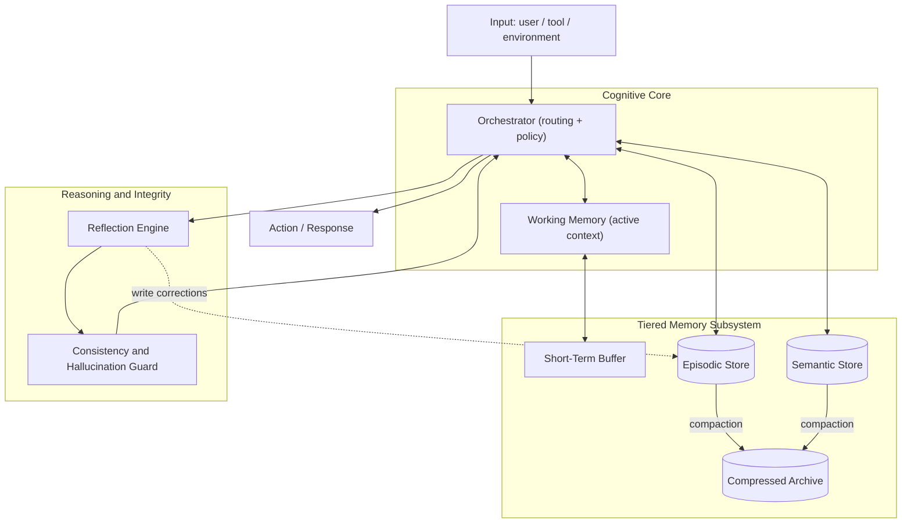

<div align="center">

# ReFlex.AI

### Persistent Cognitive Architecture for Long-Running AI Agents

*A tiered-memory cognitive runtime that gives LLM agents durable state, self-correction, and a stable identity across long horizons — hours, days, or months of continuous operation.*

</div>

---

ReFlex.AI is an open-source research and infrastructure project building **persistent cognitive architectures** for long-running AI agents and large language models. It targets the failure modes that appear once an agent runs longer than a single context window: context fragmentation, memory degradation, identity drift, fabricated history, and unreliable long-horizon reasoning.

The system is engineered **ROCm-first** and designed to run natively on **AMD Instinct™** accelerators.

## Table of Contents

- [Project Roots](#project-roots)
- [The Problem](#the-problem)
- [Architecture Overview](#architecture-overview)
- [Memory Subsystem](#memory-subsystem)
- [The Cognition Loop](#the-cognition-loop)
- [Integrity Layer: Hallucination & Consistency](#integrity-layer-hallucination--consistency)
- [Technology Stack](#technology-stack)
- [Repository Layout](#repository-layout)
- [Compute & Research Workloads](#compute--research-workloads)
- [Evaluation & Benchmarking](#evaluation--benchmarking)
- [Roadmap](#roadmap)
- [Getting Started](#getting-started)
- [Contributing](#contributing)
- [Built On](#built-on)
- [License](#license)

---

## Project Roots

> **Origins & engineering thesis.**

ReFlex.AI started from a single observation: today's agents are not unintelligent — they are **amnesiac**. A frontier model can reason brilliantly inside one context window and then lose the thread the moment that window scrolls. Everything that made the agent *itself* — its goals, its prior decisions, the facts it learned an hour ago — lives in volatile context and evaporates.

We treated this as a **systems problem, not a prompting problem.**

Biological cognition does not keep everything "in context." It separates fast volatile working memory from slow durable stores, consolidates experience during reflection, and actively reconciles new information against what it already believes. ReFlex.AI ports that separation into an engineering substrate around an LLM.

Three principles root the design:

1. **Memory is a tiered subsystem, not a prompt.** State is promoted, demoted, compacted, and expired across explicit tiers with defined retention and access semantics — the same way a memory hierarchy works in any serious system.
2. **Cognition is a loop, not a call.** The agent acts, observes, reflects, detects its own drift, and writes corrections back to memory before acting again. Self-correction is a first-class control path.
3. **Truth is reconciled, not assumed.** Every retrieval and every claim passes through a consistency layer that flags factual drift and fabricated memories instead of letting them compound.

The goal of the project is to publish **reproducible open research and infrastructure** toward stable, durable agent cognition — and to do it on an open accelerator stack.

---

## The Problem

Current long-running agents share a recognizable failure profile:

- **Context fragmentation** — relevant history falls outside the window and is silently lost.
- **Memory degradation** — repeated summarization erodes facts over time.
- **Identity drift** — goals and persona shift across sessions with no anchoring state.
- **Fabricated history** — the model invents past events it never observed.
- **Unreliable long-horizon reasoning** — consistency decays as the session lengthens.

These are not edge cases. They are the default behavior of a stateless model asked to behave statefully.

---

## Architecture Overview

ReFlex.AI wraps an LLM in a stateful cognitive runtime. An **Orchestrator** routes every input through working memory, the tiered memory subsystem, and an integrity layer before any action is emitted.



The design separates **what is happening now** (working memory), **what happened** (episodic), **what is true** (semantic), and **what can be recalled later** (compressed archive). Reflection and integrity sit on the control path, not as afterthoughts.

---

## Memory Subsystem

Memory is structured as an explicit hierarchy with defined horizon, persistence, and purpose. State moves between tiers through promotion (frequently used → durable), demotion, and compaction (durable → compressed).

| Tier | Horizon | Persistence | Purpose |
|------|---------|-------------|---------|
| **Short-Term Buffer** | turns / minutes | volatile | Raw recent input and output |
| **Working Memory** | current task | volatile | Active reasoning scratchpad bound to the context window |
| **Episodic Store** | sessions / days | durable | Time-stamped event records — *what happened, and when* |
| **Semantic Store** | long-term | durable | Distilled facts, entities, and relations — *what is true* |
| **Compressed Archive** | months+ | durable (cold) | Summarized and embedded long-tail history for recall |

**Autonomous compression** keeps the durable tiers bounded: episodic and semantic records are periodically summarized and embedded into the archive, so recall stays available without unbounded context growth. This compaction step is one of the most compute-sensitive parts of the system and a primary research target.

---

## The Cognition Loop

Self-correction is implemented as a closed loop rather than a single forward pass. After acting, the agent evaluates the outcome against its goals and memory, detects inconsistencies, and writes corrections back to durable memory before the next action.


This loop is what lets the agent **improve within a single long-running deployment** instead of repeating mistakes each session.

---

## Integrity Layer: Hallucination & Consistency

Every retrieval and generated claim is checked before it is trusted or persisted. The integrity layer is an **experimental** pipeline for catching:

- **Factual drift** — answers that diverge from previously established facts.
- **Fabricated memories** — references to events with no episodic record.
- **Invalid reasoning chains** — conclusions unsupported by retrieved evidence.
- **Inconsistent outputs** — contradictions across the session.

Flagged content is routed back to the orchestrator for correction rather than written to memory, preventing errors from compounding into permanent false state.

---

## Technology Stack

ReFlex.AI is developed **ROCm-first** so the entire stack runs on open software and AMD Instinct hardware end to end.

| Layer | Technology |
|-------|------------|
| **Accelerators** | AMD Instinct™ MI300X / MI325X / MI350X (forward-looking: MI400 series) |
| **Compute stack** | ROCm 7.x (HIP, RCCL, hipBLASLt, MIGraphX) |
| **DL framework** | PyTorch (ROCm build) |
| **Inference / serving** | vLLM (ROCm), SGLang |
| **Training / fine-tuning** | Hugging Face + Optimum-AMD, PEFT / LoRA |
| **Distributed** | RCCL collectives, optional Ray for multi-agent orchestration |
| **Retrieval** | FAISS / pgvector (configurable) |
| **Durable stores** | SQLite / PostgreSQL + object store |
| **Runtime** | Python 3.11+, async orchestration |
| **Evaluation** | Custom harness + standard long-context and agent benchmarks |

> Components marked configurable are pluggable by design; defaults are chosen to run cleanly inside the official ROCm containers.

---

## Repository Layout

```text
src/reflex/
├── core/                 # Orchestrator, policy, the cognition loop
├── memory/               # Tiered memory subsystem
│   ├── short_term.py     # Volatile buffer + working memory
│   ├── episodic.py       # Durable event store (what happened)
│   ├── semantic.py       # Durable fact store (what is true)
│   ├── archive.py        # Compressed cold-tier recall
│   ├── manager.py        # Tier coordination, retrieval fusion, compaction
│   ├── vector_index.py   # numpy (default) / FAISS ANN indexes
│   └── db.py             # SQLite persistence
├── llm/                  # LLM backends: offline mock + OpenAI-compatible (vLLM/SGLang)
├── embeddings/           # hashing (default) + sentence-transformers
├── reflection/           # Self-correction loop
├── integrity/            # Hallucination & consistency guard
├── runtime/              # Long-running Agent
├── eval/                 # Benchmark harness + synthetic datasets
└── cli.py                # `reflex run | chat | inspect | eval | config`
configs/                  # Experiment configs (YAML)
docs/                     # Architecture & configuration reference
tests/                    # Hermetic, deterministic test suite
examples/                 # Runnable quickstart
```

---

## Compute & Research Workloads

ReFlex.AI is a research system, and several of its core questions can only be answered empirically on data-center GPUs. The project is built to run on **AMD Instinct accelerators via ROCm**, with workloads that map directly onto AMD Developer Cloud instance shapes.

**Why AMD / ROCm.** Persistent-cognition research is unusually **memory-bound**: long-context experiments, large episodic/semantic stores held resident, and multi-agent rollouts all push GPU memory hard. A single **MI300X exposes 192 GB of HBM** per device, which lets us run large persistent-context experiments **without sharding the model**, simplifying the very state-management logic we are trying to study. An 8×MI300X node (≈1.5 TB aggregate HBM) covers distributed fine-tuning and reinforcement-learning rollouts. Running the full stack on an open software platform also matches the project's open-source mission — there is no proprietary lock-in anywhere in the pipeline.

**Workload profile.**

| Research workload | Scale | Suggested instance |
|-------------------|-------|--------------------|
| Long-context inference sweeps | single large model resident | 1× MI300X (192 GB) |
| Synthetic episodic/semantic dataset generation | batched inference | 1–2× MI300X |
| Memory-adapter fine-tuning (LoRA / PEFT) | mid-size models | 8× MI300X |
| Reflection / self-correction RL experiments | multi-agent rollouts | 8× MI300X |
| Hallucination & consistency benchmarking | repeated, reproducible runs | 1–8× MI300X |
| Multi-agent cognitive simulation | concurrent agents + shared memory | 8× MI300X |

All experiments are designed to be **reproducible** (pinned ROCm containers, versioned configs, published results), so any compute granted to the project produces artifacts the broader open-source community can re-run and verify.

> Interested in supporting open AI-systems research on AMD hardware? This project is exactly the kind of open-source, ROCm-native workload the [AMD Developer Cloud](https://www.amd.com/en/developer/resources/cloud-access/amd-developer-cloud.html) and AMD AI Developer Program are designed for. We'd welcome a compute collaboration — see [Contributing](#contributing).

---

## Evaluation & Benchmarking

> **Status: an initial, reproducible retention benchmark ships today (`reflex eval`); the broader suite is under construction and headline results are not yet published.** We are committed to honest, reproducible numbers and will not report metrics until each benchmark is stable.

The evaluation suite is being built to measure:

- **Memory retention** — recall accuracy as session length grows.
- **Long-session coherence** — goal and persona stability over time.
- **Reasoning consistency** — contradiction rate across a deployment.
- **Hallucination rate** — fabricated-fact frequency, with and without the integrity layer.
- **Autonomous reliability** — task success over multi-hour/multi-day runs.

Every benchmark ships with its config and seed so results are independently verifiable on the same ROCm container.

---

## Roadmap

**Phase 1 — Foundations** ✅
- [x] Memory hierarchy design & tier semantics
- [x] Agent state persistence model
- [x] Retrieval pipelines (episodic + semantic + archive, recency-fused)
- [x] Reflection framework (closed loop)
- [x] Integrity layer (grounding, drift & self-consistency checks)

**Phase 2 — Scale & Measurement** 🚧
- [x] Autonomous tier compaction into the cold archive
- [x] Memory-retention benchmark (`reflex eval`)
- [ ] Hierarchical (learned) memory compression
- [ ] Synthetic memory dataset generation
- [ ] Long-context benchmarking harness (broader suite)
- [ ] Multi-agent experimentation

**Phase 3 — Autonomy** 🔜
- [ ] Distributed cognitive simulation
- [ ] Persistent autonomous agents (multi-day deployments)
- [ ] Memory-aware fine-tuning
- [ ] Large-scale evaluation infrastructure

Legend: ✅ done · 🚧 in progress · 🔜 planned

---

## Getting Started

### Run it now — offline, no GPU required

The full cognitive runtime ships with deterministic offline backends (a mock LLM + a
dependency-free hashing embedder), so you can explore the architecture on any machine before
touching a GPU.

```bash
pip install reflexai            # from PyPI (the import name and CLI are `reflex`)

# …or from source:
git clone https://github.com/steavehirramsan/ReFlex.AI.git
cd ReFlex.AI
pip install -e .

reflex run                      # interactive REPL (:stats, :recall <q>, :quit)
reflex chat "Remember my project is ReFlex." --show-memory
reflex eval                     # reproducible memory-retention benchmark
python examples/quickstart.py   # a persistent agent in a dozen lines
```

In Python:

```python
import asyncio
from reflex import Agent, ReflexConfig

async def main():
    async with Agent.from_config(ReflexConfig.load()) as agent:
        await agent.turn("Remember that my deployment region is eu-west-2.")
        print(await agent.chat("Where am I deploying?"))   # recalls from durable memory

asyncio.run(main())
```

### On AMD Instinct — real models via ROCm

Point the OpenAI-compatible backend at a ROCm-native inference server (vLLM or SGLang) — the
only change is configuration:

```bash
# Recommended on AMD Instinct: official ROCm container
docker run -it --rm \
  --device=/dev/kfd --device=/dev/dri \
  --group-add video --cap-add=SYS_PTRACE \
  --security-opt seccomp=unconfined \
  -v "$(pwd)":/workspace -w /workspace \
  rocm/vllm-dev:nightly bash

# Inside the container
pip install -e ".[faiss,embeddings]"
vllm serve meta-llama/Llama-3.1-8B-Instruct --port 8000 &
reflex run --config configs/example.yaml      # uses the local vLLM endpoint + FAISS
```

Verify ROCm sees the accelerators:

```bash
rocm-smi
```

See [`docs/architecture.md`](docs/architecture.md) and
[`docs/configuration.md`](docs/configuration.md) for the design and full config reference.

---

## Contributing

ReFlex.AI is fully open-source and research-oriented. We welcome:

- **Code** — memory tiers, retrieval, reflection, integrity pipelines.
- **Research** — benchmarks, ablations, reproducibility studies.
- **Infrastructure** — ROCm tuning, distributed orchestration, container images.
- **Compute collaborations** — if your organization can support open ROCm-native research with GPU access, please open an issue or reach out.

Open an issue to discuss a direction before large PRs. We value reproducible, transparent contributions.

---

## Built On

ReFlex.AI stands on open infrastructure: **ROCm**, **PyTorch**, **vLLM**, **SGLang**, **Hugging Face / Optimum-AMD**, and **AMD Instinct** accelerators. Thanks to the open-source AI community building the stack that makes this research possible.

---

## License

Released under the **MIT License**. See [LICENSE](LICENSE).

---

<div align="center">

**Status:** Early Research & Development — architecture, benchmarks, and infrastructure are under active development.

*Built in the open. Built for AMD Instinct. Built to remember.*

</div>
